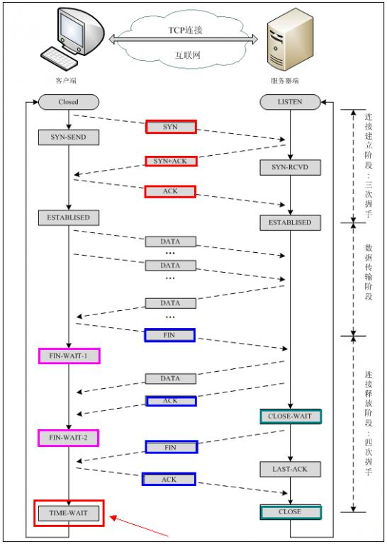

# 网络协议

## 负载均衡

[https://www.cnblogs.com/ilinuxer/p/6916913.html](https://www.cnblogs.com/ilinuxer/p/6916913.html)

## 网络协议

> [https://www.cnblogs.com/li-hao/archive/2011/12/07/2279912.html](https://www.cnblogs.com/li-hao/archive/2011/12/07/2279912.html) [https://blog.csdn.net/qq\_34501940/article/details/51073691](https://blog.csdn.net/qq_34501940/article/details/51073691)
>
> * 有哪些私有或者保留地址说说

* A类：10.0.0.0 - 10.255.255.255
* B类：172.16.0.0 - 172.31.255.255
* C类：192.168.0.0 - 192.168.255.255
* IP地址分类，简单说一下各个分类

  |  |  |  |  |  |
  | :--- | :--- | :--- | :--- | :--- |
  | A类 | 以0开头 | 10.0.0.0-127.255.255.255 |  |  |
  | B类 | 以10开头 | 128.0.0.0-191.255.255.255 |  |  |
  | C类 | 以110开头 | 192.0.0.0-2 |  |  |

* 简单解释ARP协议的工作过程
  * 首先，每个主机都会在自己的ARP缓存中建立一个ARP列表，已表示IP地址和mac地址之间的关系。
  * 当源主机要发送数据时，首先检查ARP列表中是否有对应的IP地址的目的主机的mac地址。如果有，则直接发送数据，如果没有，就向本网段所有主机发送ARP，该数据包包括的内容有：源主机ip地址，源主机mac地址，目的主机IP地址。
  * 当本网络所有主机收到ARP数据包时，首先检查数据包中的ip地址是否是自己的地址，如果不是则忽略数据包，
* OSI七层模型

  应用层、表示层、会话层、传输层、网络层、数据链路层、物理层

* TCP／IP四层模型

  应用层、传输层、网络互联层、网络接口层

* 了解的端口和对应的服务

  * FTP：21 、SSH：22、telnet：23、http:80、HTTPS：443、oracle：1521、mysql：3306、dns：53、smtp：25

  ​

### HTTP

#### 状态码

* 502 作为网关或者代理工作的服务器尝试执行请求时，从上游服务器接收到无效的响应。
  * php-fpm没有启动,nginx无法将请求交给php-fpm
  * php-fpm运行脚本超时，php-fpm终止了脚本的执行和执行脚本的Worker进程，nginx发现自己与php-fpm的连接断开。
* 504 
  * 504即nginx超过了自己设置的超时时间，不等待php-fpm的返回结果，直接给客户端返回504错误。但是此时php-fpm依然还在处理请求（在没有超出自己的超时时间的情况下）。
  * 这里有三个相关的配置：
    * fastcgi\_connect\_timeout 300;

      指定连接到后端FastCGI的超时时间。

    * fastcgi\_send\_timeout 300;

      向FastCGI传送请求的超时时间，这个值是指已经完成两次握手后向FastCGI传送请求的超时时间。

    * fastcgi\_read\_timeout 300;

      接收FastCGI应答的超时时间，这个值是指已经完成两次握手后接收FastCGI应答的超时时间。
* 499 客户端主动断开链接，一般是因为超时导致
* 301 被请求的资源已永久移动到新位置
* 302 要求客户端执行临时重定向
* 304 表示资源未被修改
* 401 用户没有必要的凭据
* 403 服务器已经理解请求，但是拒绝执行它

#### Cookie

通常我们有两种方式给浏览器设置或获取Cookie，分别是HTTP Response Headers 中的Set-Cookie和HTTP Request Headers中的Cookie Header，以及通过JavaScript对document.cookie进行赋值或取值。

#### 安全相关的HTTP响应头

**Strict-Transport-Security**

支持HSTS的浏览器遇到这个响应头，会把当前网站加入HSTS列表，然后再max-age指定的秒数内。当前网站所有请求都会被重定向为https。

**X-Frame-Options**

是为了减少劫持二引入的一个响应头

这个响应头支持三种配置：

* DENY：不允许被任何页面嵌入
* SAMEORIGN：不允许被本域以外的页面嵌入
* ALLOW-FROM uri：不允许被指定的域名以外的页面嵌入

**X-XSS-Protection**

这个响应头是用来防范XSS的。它有集中配置：

* 0：禁用XSS保护
* 1：启用XSS保护
* 1；mode=block：启用XSS保护，并在检查到XSS攻击时，停止渲染页面。

**X-Content-Type-Options**

#### Transfer-Encoding

Transfer-Encoding 是一个HTTP头部字段，字面意思是传输编码。实际上，HTTP协议中还有另外一个头部与编码相关：Content-Encode（内容编码）。Transfer-Encoding则是用来改变报文格式。

**Persistent Connection（长连接）**

HTTP 1.0的持久连接机智是后来才引入的，通过Connection：keep-alive这个头部实现，服务端和客户端都可以使用它告诉对方在发送完数据后不要断开TCP连接。

HTTP 1.1 则规定所有连接都必须是持久的，除非显示的在头部加上Connection：close。所以实际上，HTTP1.1中Connection这个头部字段已经没有keep-alive这个取值了。

对于非持久连接，浏览器可以通过连接是否关闭来界定请求或响应实体的边界；而对于持久连接，这种方法显然不奏效。

**Content-Length**

要解决这个问题，最容易想到的办法就是计算实体长度。并通过头部告诉对方。如果长度不一致，如果Content-length长度比实际长度短，会造成内容被截断；如果比实体内容长，会造成pending。

**Transfer-Encoding：chunked**

头部加入了Transfer-Encoding:chunked后，就代表这个报文采用了分块编码。最后一个分块长度必须为0，对应分块数据没有内容，表示实体结束。

前面说过Content-Encoding和Transfer-Encoding二者经常会结合来用，其实就是针对Transfer-Encoding的分块再进行Content-Encoding。

#### Accept-Encoding/Content-Encode

工作机制：通过Accept-Encoding带上自己支持的编码格式列表；服务端从中调选一种用来进行文本编码，并通过Content-Encoding指明选定的格式。

#### 用户IP

* 直接对外提供服务的web应用，在进行与安全相关的操作时，只能通过Remote Address获取真实ip。
* 使用Nginx等Web Server进行反向代理的web应用，在配置正确的前提下，要用X-Forwarded-For最后一节或X-Real-IP来获取IP（因为RemoteAddress得到的IP是nginx所在的服务器的IP）；

**X-Forwarded-For**

用来表示请求的真实ip

```text
X-Forwarded-For: client, proxy1, proxy2
```

**X-Real-IP**

产生TCP连接的设备

**Remote Address**

通过 Nginx 访问 Node.js 服务，得到的 Remote Address 实际上是 Nginx 的本地 IP。

#### Vary

Vary用来列出一个相应字段列表，告诉缓存服务器遇到同一个URL对应不同版本文档的时候，如何缓存和筛选合适的版本。

#### SSE

我们知道HTTP只能由客户端发起连接，在由服务期响应，SSE也是这样，只不过服务端会保持这个链接，多次发送相应。

#### WS（Websocket）

Websocket是基于TCP实现的，HTTP协议中的那些概念都不复存在。但他还是依赖于HTTP，因为Websocket的握手阶段利用了HTTP的Upgrade机制。一旦握手完成，后续数据传输就直接在TCP上完成。

#### 从nginx默认不压缩http1.0说起

对于TCP持久连接的HTTP报文，客户端需要一种机制来准确判断结束位置。而在HTTP1.0中，这种机制只有Content-length。于是，对于本文前面提出的情况，HTTP只能要么不压缩，要么不启用持久连接（对于非持久连接，TCP断开就可以认为HTTP报文结束），而nginx默认选择前者。

#### 简述GET和POST区别

* 从原理上看
  * 根据http规范，GET用于信息获取，而且应该是安全和幂等的
  * 根据http规范，POST请求用于表示可能修改服务器上资源的请求
* 从表面上看
  * GET请求的数据会附在URL后面，POST的数据放在HTTP包体
  * POST安全性比GET安全性高

### HTTPS

屈光宇

#### 主要功能

* 内容加密
* 身份认证
* 数据完整性

#### 对称加密

对称加密有点是强度非常高，难破解。缺点是无法安全的生成和保存密钥，需要管理海量密钥

#### 非对称加密

非对称加密主要用于密钥交换。

**缺点**

* CPU计算资源消耗非常大。一次完全的TLS握手，密钥交换时的非对称解密计算量占整个握手过程的90%以上。而对称加密的计算量只相当于非对称加密的0.1%。
* 非对称加密对加密内容的长度有限制，不能超过公钥长度。

**算法**

* RSA：算法实现简单，诞生于1977年。安全性高。缺点就是需要比较大的素数来保证安全强度，很消耗CPU，RSA是目前唯一一个既能用户密钥交换又能用于证书签名的算法
* DH：diffie-hellman 诞生于1977年，但是1999年才公开，缺点是比较消耗CPU性能。
* ECDHE：使用椭圆曲线（ECC）的DH算法，有点是能用较小的素数（256位）实现RSA相同的安全等级。缺点是算法实现复杂，用于密钥交换的历史不长。
* ECDH：不支持PFS
* DHE：不支持ECC。非常消耗CPU资源。

#### False Start

False Start 有抢跑的意思，意味着不按规则行事。TLS False Start 是指客户端在发送Change Cipher Spec Finished同事发送应用数据，服务端在TLS握手完成时直接返回应用数据。

#### 证书链

配置证书链的最佳实践是只包含站点证书和中间证书，不要包含根证书，也不要漏掉中间证书。大部分站点证书链都是“站点证书-中间证书-根证书”这样三级，这时服务器端只需要发送前两个证书即可。但也有的证书链又四级，那就需要发送站点证书外加两个中间证书了。

#### ECC certificate

如果需要进一步减小证书大小，可以选择ECC证书。256位的ECC key等同于3072位的RSA key，在确保安全性的同时，体积大幅减小。

ECC证书这么好，为什么没有普及呢？最主要的原因是他的支持情况并不好。所以，确定使用ECC证书前需要明确用户分布情况。

### HTTP 2

### TCP/IP

#### -WAIT

**TIME-WAIT存在的主要原因有两点**

> [http://blog.csdn.net/slvher/article/details/8941873](http://blog.csdn.net/slvher/article/details/8941873)
>
> [http://blog.csdn.net/whuslei/article/details/6667471](http://blog.csdn.net/whuslei/article/details/6667471)

1. 为实现TCP这种全双工（full-duplex）连接的可靠释放

   参考本文前面给出的TCP释放连接4次挥手示意图，假设发起active close的一方（图中为client）发送的ACK（4次交互的最后一个包）在网络中丢失，那么由于TCP的重传机制，执行passiveclose的一方（图中为server）需要重发其FIN，在该FIN到达client（client是active close发起方）之前，client必须维护这条连接的状态（尽管它已调用过close），具体而言，就是这条TCP连接对应的（local\_ip, local\_port）资源不能被立即释放或重新分配。直到romete peer重发的FIN达到，client也重发ACK后，该TCP连接才能恢复初始的CLOSED状态。**如果activeclose方不进入TIME\_WAIT以维护其连接状态，则当passive close方重发的FIN达到时，active close方的TCP传输层会以RST包响应对方，这会被对方认为有错误发生（而事实上，这是正常的关闭连接过程，并非异常）。**

2. 为使旧的数据包在网络因过期而消失

   为说明这个问题，我们先假设TCP协议中不存在TIME\_WAIT状态的限制，再假设当前有一条TCP连接：\(local\_ip, local\_port, remote\_ip,remote\_port\)，因某些原因，我们先关闭，接着很快以相同的四元组建立一条新连接。本文前面介绍过，TCP连接由四元组唯一标识，因此，在我们假设的情况中，TCP协议栈是无法区分前后两条TCP连接的不同的，在它看来，这根本就是同一条连接，中间先释放再建立的过程对其来说是“感知”不到的。这样就可能发生这样的情况：前一条TCP连接由local peer发送的数据到达remote peer后，会被该remot peer的TCP传输层当做当前TCP连接的正常数据接收并向上传递至应用层（而事实上，在我们假设的场景下，这些旧数据到达remote peer前，旧连接已断开且一条由相同四元组构成的新TCP连接已建立，因此，这些旧数据是不应该被向上传递至应用层的），从而引起数据错乱进而导致各种无法预知的诡异现象。作为一种可靠的传输协议，TCP必须在协议层面考虑并避免这种情况的发生，这正是TIME\_WAIT状态存在的第2个原因。  
   具体而言，local peer主动调用close后，此时的TCP连接进入TIME\_WAIT状态，处于该状态下的TCP连接不能立即以同样的四元组建立新连接，即发起active close的那方占用的local port在TIME\_WAIT期间不能再被重新分配。由于TIME\_WAIT状态持续时间为2MSL，这样保证了旧TCP连接双工链路中的旧数据包均因过期（超过MSL）而消失，此后，就可以用相同的四元组建立一条新连接而不会发生前后两次连接数据错乱的情况。

   ​

#### Common Sense

* TCP和UDP的区别
  * TCP面向连接，UDP面向非连接
  * TCP提供可靠的服务，UDP无法保证
  * TCP面向字节流，UDP面向报文
  * TCP传输数据慢，UDP数据传输快
* TCP三次握手
  * 第一次握手，客户端发送连接请求报文段，将SYN位置为1，sequence number为x，然后客户端进入SYN\_SEND状态，等待服务器确认
  * 第二次握手，服务端收到客户端的SYN报文段，需要对这个SYN报文段进行确认，设置Acknowledgment Number为x＋1；同时，自己还要发送SYN请求信息，将SYN位置为1，Sequence Number为y，服务端将上述所有信息昂岛一个报文段（SYN＋ACK报文）中，一并发送给客户端，此时服务端进入SYN\_RECV状态。
  * 第三次握手，客户端收到SYN\_ACK报文段。然后将Acknowledgment Number设置为y+1，向服务端发送ACK报文段，这个报文段发送完毕之后，客户端和服务端都进入ESTANBLISHED状态，完成TCP三次握手
* 图解三次握手和三次挥手

  

#### 慢启动

The sender starts by transmitting one segment and waiting for its ACK. When that ACK is received, the congestion window is incremented from one to two, and two segments can be sent. When each of those two segments is acknowledged, the congestion window is increased to four. This provides an exponential growth, although it is not exactly exponential because the receiver may delay its ACKs, typically sending one ACK for every two segments that it receives.

The sender can transmit up to the minimum of the congestion window and the advertised window. The congestion window is flow control imposed by the sender, while the advertised window is flow control imposed bythe receiver.

> maxcdn：[https://www.maxcdn.com/one/visual-glossary/tcp-slow-start/](https://www.maxcdn.com/one/visual-glossary/tcp-slow-start/)
>
> rfc文档：[https://tools.ietf.org/html/rfc2001](https://tools.ietf.org/html/rfc2001)

#### 拥塞避免

If cwnd is less than or equal to ssthresh, TCP is in slow start; otherwise TCP is performing congestion avoidance.

Slow start has cwnd begin at one segment, and be incremented byone segment every time an ACK is received. As mentioned earlier,this opens the window exponentially: send one segment, then two,then four, and so on. Congestion avoidance dictates that cwnd beincremented by segsize\*segsize/cwnd each time an ACK is received,where segsize is the segment size and cwnd is maintained in bytes.This is a linear growth of cwnd, compared to slow start'sexponential growth. The increase in cwnd should be at most onesegment each round-trip time \(regardless how many ACKs arereceived in that RTT\), whereas slow start increments cwnd by thenumber of ACKs received in a round-trip time.

#### 快速重传

快重传算法还规定，发送方只要一连收到三个重复确认就应当立即重传对方尚未收到的报文段M3，而不必继续等待M3设置的重传计时器到期。由于发送方尽早重传未被确认的报文段，因此采用快重传后可以使整个网络吞吐量提高约20%。

#### 快速恢复

快重传配合使用的还有快恢复算法，其过程有以下两个要点：

* 当发送方连续收到三个重复确认，就执行“乘法减小”算法，把慢开始门限ssthresh减半。这是为了预防网络发生拥塞。请注意：接下去不执行慢开始算法。
* 由于发送方现在认为网络很可能没有发生拥塞，因此与慢开始不同之处是现在不执行慢开始算法（即拥塞窗口cwnd现在不设置为1），而是把cwnd值设置为慢开始门限ssthresh减半后的数值，然后开始执行拥塞避免算法（“加法增大”），使拥塞窗口缓慢地线性增大。

  也有的快重传实现是把开始时的拥塞窗口cwnd值再增大一点，即等于 ssthresh + 3 X MSS 。这样做的理由是：既然发送方收到三个重复的确认，就表明有三个分组已经离开了网络。这三个分组不再消耗网络 的资源而是停留在接收方的缓存中。可见现在网络中并不是堆积了分组而是减少了三个分组。因此可以适当把拥塞窗口扩大了些。

